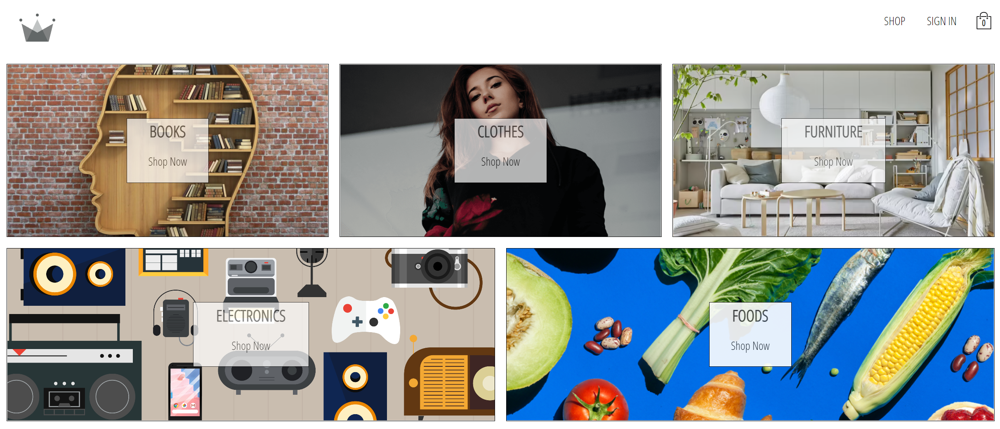

"eMALL-REACT" is an e-commerce web project built with REACT.js.

Users can browse the products, sign up by email and google accounts, add item to their shopping cart and check out.
Language:HTML/CSS/Javascript
Authentication: Firebase
Database: Firebase

project sketch:

